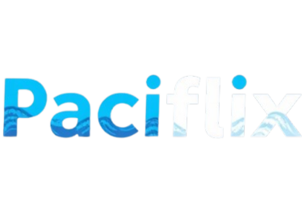
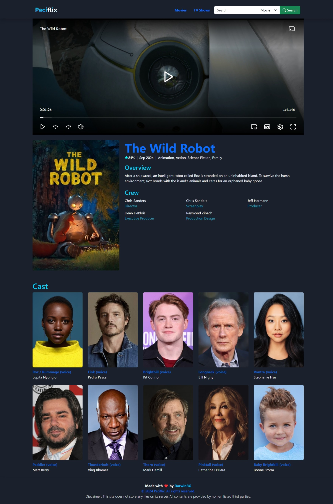

&nbsp;

# 🌊 Paciflix 🍿

Paciflix is a streaming site that offers a wide variety of movies and TV shows. Enjoy seamless streaming with our user-friendly interface and high-quality content.

## ✨ Features

- User-friendly interface
- High-quality streaming
- Wide variety of movies and TV shows
- Multiple device support
- Regular content updates
- Multi-language subtitles
- Secure and private

&nbsp;


## 🌐Website Link

### Main
https://paciflix.darwinrg.me/


### Backup
https://paciflix.darwinrg.tech/


## 🙏 Acknowledgements

- [Embed.su](https://embed.su/) (Video Content)

  &nbsp;

## 🧑 Author

- [@DarwinRG](https://github.com/DarwinRG)

&nbsp;

## 📒 Requirements

### Major Requirements

- PHP 8 or higher
- Composer
- MySQL or any other supported database
- Web server (Apache, Nginx, etc.)
- Node.js and npm (for frontend dependencies)
- Git (for version control)

### API Integration

- [The Movie Database](https://www.themoviedb.org/)

&nbsp;

## 🛠️ Installation

### 📥 Downloading or Cloning the Repository

You can download the repository as a ZIP file and extract it, or you can clone the repository using Git.

#### 📦 Downloading as ZIP

1. Click the "Code" button on the repository page.
2. Select "Download ZIP".
3. Extract the ZIP file to your desired location.

#### 🌀 Cloning with Git

1. Open a terminal.
2. Run the following command to clone the repository:

```sh
git clone https://github.com/DarwinRG/Paciflix.git
```

3. Navigate to the project directory:

```sh
cd Paciflix
```

### ⚙️ Initial Setup

1. Open a terminal and navigate to the project directory. Then run the following command to install the composer packages:

```sh
composer install
```
2. Create the Environment Variables

```sh
cp .env.example .env
```


3. Generate Application key

```sh
php artisan key:generate
```

4. Install frontend dependencies using npm

```sh
npm install
```

&nbsp;

## 🔧 Environment Variables

To run this project, you will need to configure the following variables to the **.env**

### TMDB API TOKEN
```sh
TMDB_TOKEN=
```
You need to get your TMDB Token at https://www.themoviedb.org/


### DATABASE CONFIGS
```sh
DB_CONNECTION=
DB_HOST=
DB_PORT=
DB_DATABASE=
DB_USERNAME=
DB_PASSWORD=
```


&nbsp;

## ▶️ Running the application

After setting up the environment and installing the dependencies, you can run the application with:

```sh
php artisan serve
```
Then create a new terminal and create a new node development server

```sh
npm run dev
```
&nbsp;

## 📊 Output

After running the command, the terminal will generate an output

```
Starting Laravel development server: http://127.0.0.1:8000
```

You can now visit http://127.0.0.1:8000 to view the application.

## 📈 Screenshots

### Login Page


### Homepage


### TVSHOW


### Player


&nbsp;

## 📜 License

This project is licensed under the Apache License 2.0. See the [LICENSE](LICENSE) file for details.